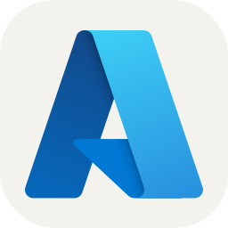

### [Jadhusan Sadhik](https://jadhusan.com) 👋

Researching, Writing, Learning and Contributing to Technology.

• Cybersecurity Engineer with Knack of Cloud Computing. \
• Microsoft Certified Professional | Microsoft Certified Trainer \
• Portfolio https://jadhusan.com and Contributor in https://blog.jadhusan.com. \
• Author in Medium | YouTuber & Twitch Streamer \
• GitHub Global Campus Student | GitHub Developer Program Member

</a>

## Connect with me:

 
 

</a>

## My Journey
Certificates:
* Microsoft Azure Administrator - **Microsoft**
* CompTIA Server+ SK0-005 - **CompTIA**
* Cisco Certified Network Associate - **CISCO**
* Microsoft Certified Solution Expert - **Microsoft**
* Microsoft Certified Solution Associate - **Microsoft** 
 
 

</a>

## Recent Publication 
- [Microsoft Azure](https://blog.jadhusan.com/category/cloud-computing/microsoft-azure/)
- [Microsoft Windows Server](https://blog.jadhusan.com/category/infrastructure-solution/microsoft-windows-server/)
- [Cybersecurity Solution](https://blog.jadhusan.com/category/cybersecurity-solution/)
- [Infrastructure Solution](https://blog.jadhusan.com/category/infrastructure-solution/)

## Recent Projects
- [Implementation of Firewall - Python3](https://blog.jadhusan.com/firewall/)
- [Implementation of IpSec Tunnel - Python3](https://blog.jadhusan.com/ipsec-tunneling/)

## GitHub Stats

## Languages and Tools:

